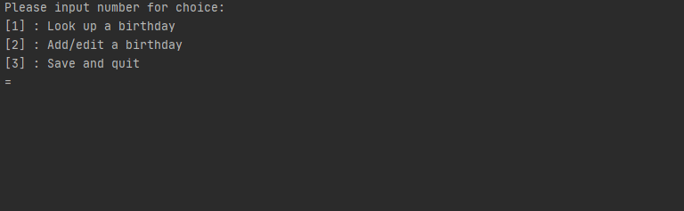

### Manipulating a .JSON file
Using a .JSON file to store and retrieve birthday data.
New data can be saved and added.

- [ ] Improve listing interface
- [ ] User input checks
- [ ] \(Optional) Attempt handling a large set of birthdays
